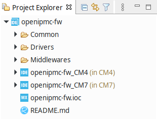
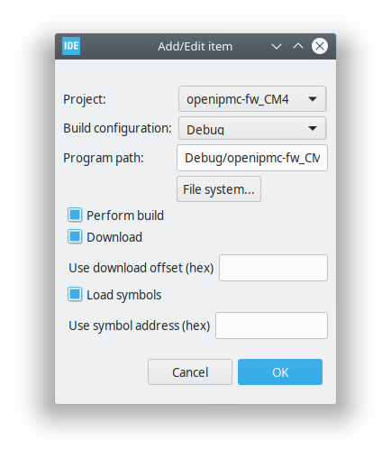
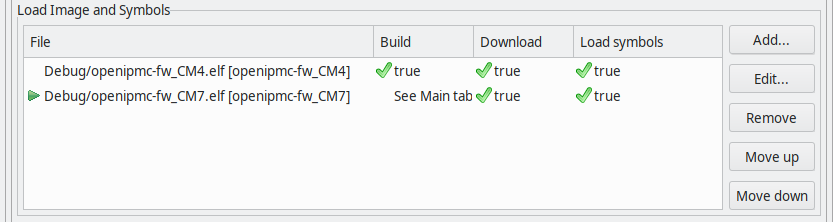
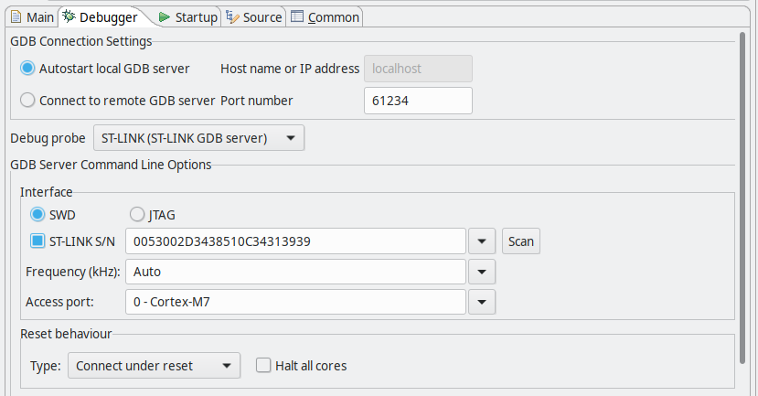

# Setup the IDE

OpenIPMC-FW is a reference firmware and it is not developed for any specific ATCA board. However, it implements a minimally functional IPMC which can be modified to satisfy the needs of any specific ATCA board.

Since OpenIPMC-FW is being developed using the STM32CubeIDE from STMicroelectornics, the following instructions guide the users to clone the project and prepare the STM32CubeIDE workspace to start their adaptions.

## Workspace Setup 

The following steps instructs how to add this project into the  **STM32CubeIDE 1.5.0** workspace.

1. Clone the project into the chosen workspace directory:

        $ git clone git@gitlab.com:openipmc/openipmc-fw.git
        
2. Clone *submodules*:

        $ cd openipmc-fw
        $ git submodule update --init --recursive

3. In STM32CubeIDE, go to *File* &rarr; *Import*.

4. In *Import* menu, go to *General* &rarr; *Existing Projects into Workspace*

5. In *Select root directory* box, enter (or browse) the workspace directory path. 

    **NOTE:** Do not enter the project directory path here, but the directory which contains `openipmc-fw`.
    
6. In *Projects* box, mark the *openipmc-fw* and the two respective nested projects for CM4 and CM7 cores:

    - openipmc-fw
    - openipmc-fw_CM4
    - openipmc-fw_CM7
    
7. Press *Finish*. When import is concluded, you should see in the *Project Explorer* a structure like this:

    

## Compiling and Debugging

A basic debugging configuration for Cortex-M7 is presented bellow. For better information about debugging, please refers to the Application Note [AN5361](https://www.st.com/resource/en/application_note/dm00629855-getting-started-with-projects-based-on-dualcore-stm32h7-microcontrollers-in-stm32cubeide-stmicroelectronics.pdf).

1. In *Project Explorer* tab, Right click on *openipmc-fw_CM4*. Click in *Build Project*.

2. Repeat for *openipmc-fw_CM7*.

3. In *Project Explorer* tab, Right click on *openipmc-fw_CM7*. Click *Debug As* &rarr; *1 STM32 Cortex-M C/C++ Application*.

4. Despite we are going to debug only the CM7 core, the CM4 firmware (which has no practical purpose in this project so far) also need to be loaded. In tab *Startup*, click *Add...* and configure as below:

    

    

5. In tab *Debugger* mark *ST-LINK S/N* and click *Scan*. If IDE recognizes a ST-LINK connected, the serial number will appear in the field.

    

6. Click *Ok* to start debugging. Debugger will halt at the beginning of the `main()` function. Click  (Resume) to start.

